+++
date = '2026-03-08T16:33:02Z'
draft = false
title = 'Missão Malásia - parte 1'
description = "produção de quadros elétricos na Malásia"

showHero = true
  heroStyle = "background" # valid options: basic, big, background, thumbAndBackground
  layoutBackgroundBlur = true # only used when heroStyle equals background
  layoutBackgroundHeaderSpace = true # only used when heroStyle equals background
showTableOfContents = true
showZenMode = true
series = [ "Missão Malásia" ]
series_order = 1

+++
<!--
-->
# Missão Malásia - o início

## Aventura profissional na Malásia em fotografias comentadas

"Mais do que uma experiência profissional foi uma aventura com uma enorme aprendizagem"

> [!note]-Nota
> Estas fotos foram tiradas em contexto laboral e algumas continham à data informação sensível  que não permitiam a sua divulgação ao abrigo de um acordo de não-divulgação.
  Passado dez anos e o produto fora do mercado, partilho pela primeira vez algumas fotos para documentar a minha aprendizagem nesta experiência profissional

## Introdução

Missão:

Montar um local de produção na Malásia capaz de produzir quadros elétricos com o mesmo rigor e qualidade do que aqueles produzidos na Suíça.

Em final de janeiro de 2010 fui selecionado para em conjunto com um colega, o Silvan Muller, desempenhar uma nova função: Partir para a Malásia onde, junto das instalações do nosso cliente iríamos montar e arrancar uma zona de produção capaz de produzir um quadro elétrico, o 500SDB6, com o mesmo rigor e qualidade do que aquele que era produzido na Suíça.

> [!abstract]link
 <a class="text-sm" href="https://caeonline.com/buy/crystal-growing-sawing-slicing/amat-applied-materials-hct-e500sd-b-5/293628102" target="_blank" rel="noopener">anúncio de HCT 500SDB5 usada para venda </a>

 O cliente da empresa, tinha começado a produzir na Malásia, e seria vantajoso e benéfico para todos, se a nossa empresa acompanhasse esta deslocalização para a Ásia.

Numa pequena área adjacente às instalações do cliente, em plena [FIZ](https://en.wikipedia.org/wiki/Bayan_Lepas_Free_Industrial_Zone) (free industrial zone) de Penang, onde grandes empresas tecnológicas populavam por todo o lado, tínhamos como desafio implementar e arrancar com uma unidade de produção de quadros elétricos que iria alimentar diretamente a produção da máquina do cliente.

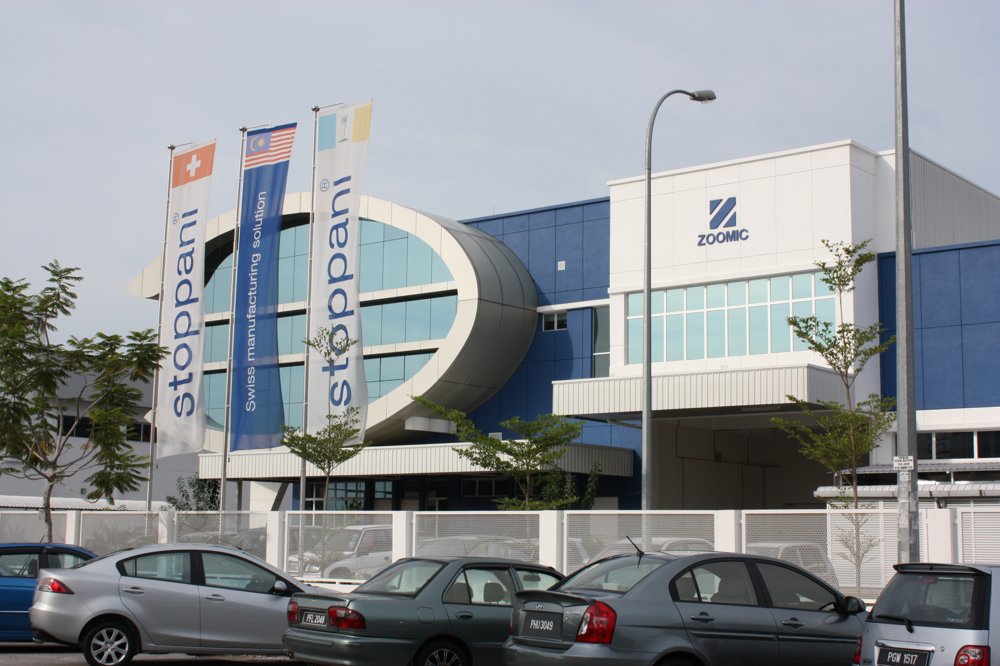

Na Malásia estaria o futuro local de produção. Toda a máquina suporte, incluindo a logística, o stock e as compras seria gerida na Suíça.

O Silvan como chefe de operações e meu chefe direto ocupar-se-ia da gestão com a suíça e com o cliente, dos RH e procedimentos administrativos locais. Eu seria o responsável pela produção.

Teria de:

Definir o layout da área de produção e implementar zonas de trabalho para diversas operações de montagem.

Criar em creform mobiliário necessário nas zonas de trabalho.

Treinar e formar os colaboradores locais de forma a estarem aptos a executar a montagem segundo o rigor e qualidade imposto pela empresa suíça.

A missão teria uma duração aproximada de 6 meses. O primeiro objetivo era o de construir um quadro de força e um quadro de comando, entregues para serem instalados, testados e validados pelo cliente. Seguido do objetivo de planear e gerir a montagem de forma a assegurar a produção de armários MaxEdge segundo a planificação e encomendas do cliente.

Além da óbvia vantagem de uma entrega direta sem logística e zero metros do cliente por ter a nossa produção de quadros elétricos na zona anexa à sua produção, outra grande vantagem era o suporte técnico no local. Deixava de ser necessário as videochamadas e eventual deslocação de um técnico que teria de vir da suíça se surgisse um problema que o justificasse.

Eu iria assegurar o suporte técnico e a garantia ao cliente sobre os quadros produzidos.

Tudo era novo e desafiante para todos. Para nós que partíamos para a Malásia e também para a empresa com esta expansão e toda a gestão e logística de uma primeira filial no estrangeiro.

<iframe src="https://www.google.com/maps/embed?pb=!1m18!1m12!1m3!1d380899.0015056684!2d100.02839757738248!3d5.389355721729015!2m3!1f0!2f0!3f0!3m2!1i1024!2i768!4f13.1!3m3!1m2!1s0x304a9403095390dd%3A0x29c305a5f38f633f!2sPenang%2C%20Mal%C3%A1sia!5e0!3m2!1spt-PT!2spt!4v1773150020330!5m2!1spt-PT!2spt"  style="display: block; margin-left: auto; margin-right: auto; width: 80%;" loading="lazy" referrerpolicy="no-referrer-when-downgrade"></iframe>

 #### MaxEdge

Nas fotos podemos ver os quadros elétricos da máquina 500SDB6 ou Maxedge.
Do lado esquerdo o quadro elétrico da parte de comando, e do lado direito o quadro elétrico da parte da força.


  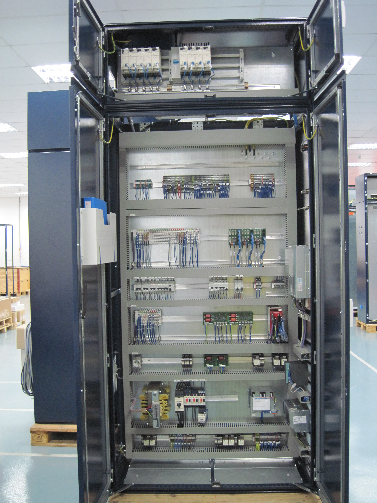
  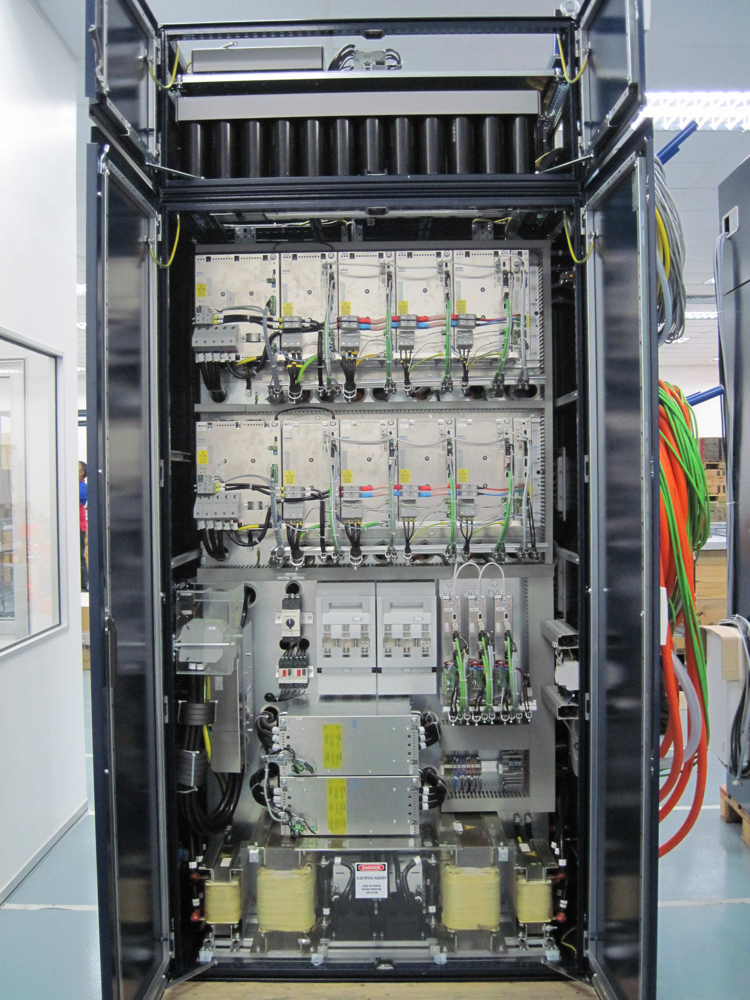


Na fotografia abaixo podemos ver a MaxEdge em fase de montagem (produção do lado do cliente), onde se podem ver os quadros elétricos já instalados.

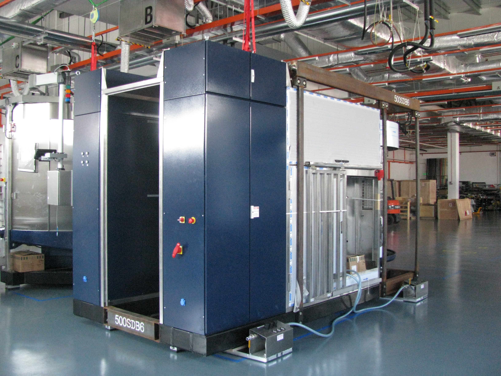

### Jan / Fev 2010 – Preparação

A viagem para a Malásia estava marcada para início de março.

O final de janeiro e o mês fevereiro foram ocupados com a elaboração de listas de material e listas de ferramentas e a processar tudo o que tinha de ser enviado para a Malásia.

Como kit inicial para o arranque, iria ser enviado para a Malásia todo o material necessário e pronto para construir duas unidades Maxedge.
A primeira encomenda de creform completava o nosso kit de arranque.

Tivemos uma formação de creform, o material que seria usado para construir mobiliário de produção, junto do nosso cliente.

Tive uma formação do HMI da máquina e uma grande ajuda de toda a equipa de engenharia, com as ferramentas de software da empresa, para estar apto a diagnosticar e reparar na Malásia eventuais avarias.

Ver e sentir a produção, com um novo olhar. Ouvi pela primeira vez o conceito de LEAN, e a ver a produção como um conjunto de operações, tempos e cargas de operações.

Ouvi pela primeira vez o conceito de LEAN, e entrei num mundo de kamban, kaizen, 5S e contínuos improvement.

Sentir a produção como um conjunto de operações, tempos e cargas de operações.

### Março 2010 -Chegada à ilha


  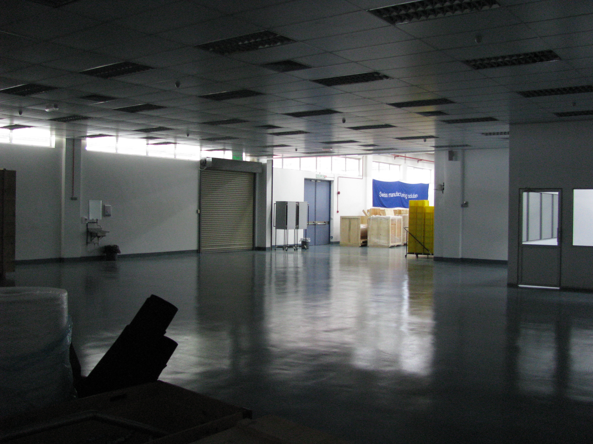
  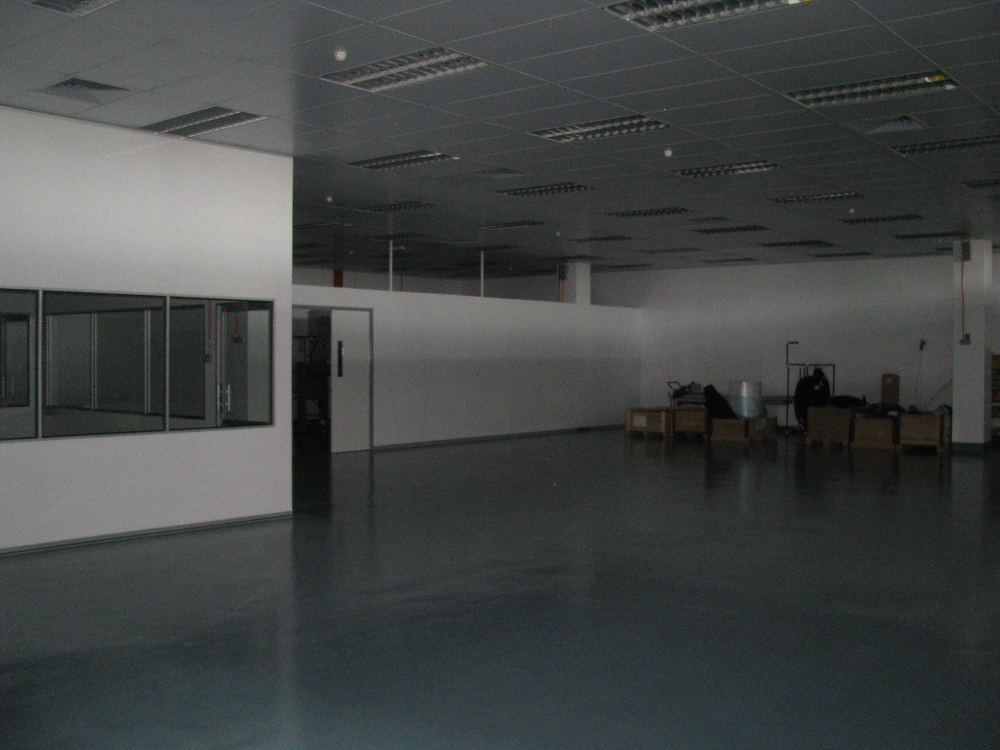


Com partida de Zurique às 21h40 do dia 01/03, chegamos a Penang na manhã do dia 2, onde o nosso diretor local nos esperava para nos levar à nossa “casa” em Penang.

Dia 3 fomos até ao local pela primeira vez. Estávamos lá. Prontos a começar.

As instalações eram limpas, iluminadas com controle de temperatura e humidade e acessos controlados.

Havia encomendas locais a tratar como o mobiliário do escritório e serviços a contratar como telefone e Internet.

Era preciso agilizar e resolver todo a documentação para desalfandegar o mais breve possível o nosso kit de arranque que tinha sido enviado.


  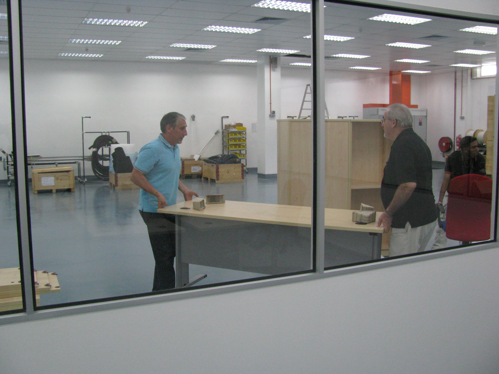
  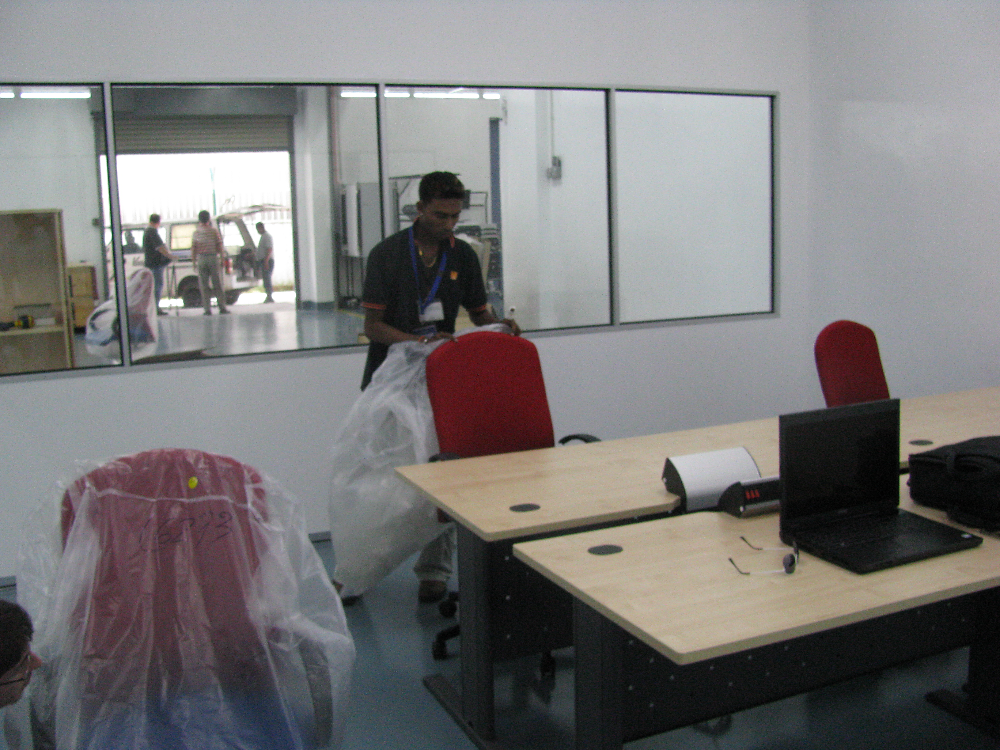


A minha primeira missão consistia em:

* ensinar e treinar os colaboradores locais a fazerem a cablagem e a montar os quadros elétricos

* criar um processo de produção com áreas e operações definidas

* criar mobiliário de produção para as áreas definidas

É desalfandegada a carga e chega finalment às instalações o **kit de montagem** **kick-off**

As últimas duas semanas na Suíça foram sobretudo a rever listas, e garantir que tudo o que tinha sido planeado e incluído no chamado kit de startup montagem estava empacotado e pronto a seguir no avião.

Incluía:

* Todos os componentes para produzir dois conjuntos da Maxedge

* Todo os cabos utilizados e todo o material de apoio à montagem, desde parafusos a abraçadeiras de fivela

* Toda a ferramenta para realizar todas as operações (x12 sendo para 8 funcionários e 4 spares)

* Todo o material, ferramenta, software e afins para realizar os testes aos quadros produzidos e, garantir a reparação de eventuais avarias

* O kit da creform para construir o mobiliário


  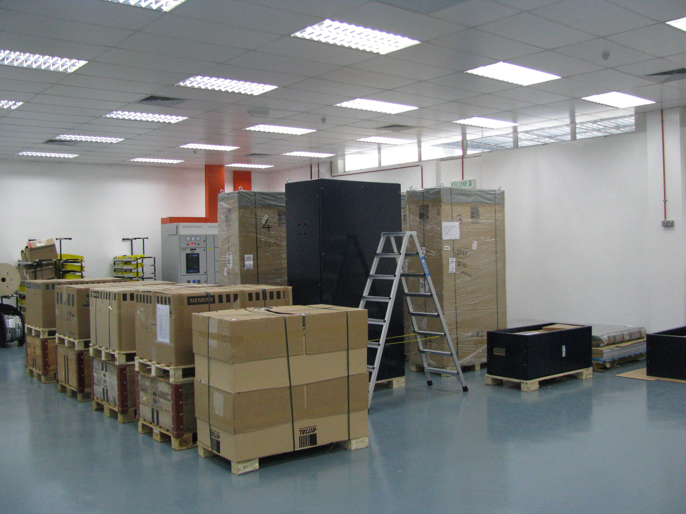
  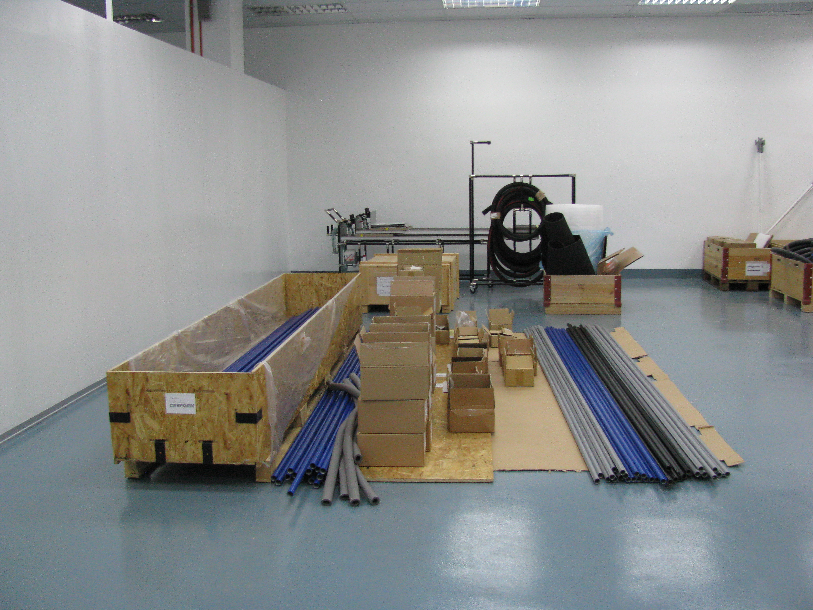


#### creform

O nosso cliente e vizinho tinha todo o mobiliário de produção construído com o sistema <a href="https://creform.com/index.html" target="_blank" rel="noopener">creform</a> e tinham uma vasta experiência com o creform. Em Fevereiro, o Silvan e eu tínhamos tido uma formação nas instalações do cliente em Neuenegg na Suiça, onde nos tinha sido apresentado o sistema creform e mostrado as possibilidades. Tínhamos ficado com uma ideia do sistema creform e com dezenas de ideias de projetos para a nossa área de produção. Agora começavamos a construir. 

A primeira construção foi um simples carrinho para os contentores plásticos que iriam conter o material para as operações de montagem.

Ao final do dia e utilizando a serra do nosso vizinho cortávamos os tubos e iamos construindo estruturas para a produção.


  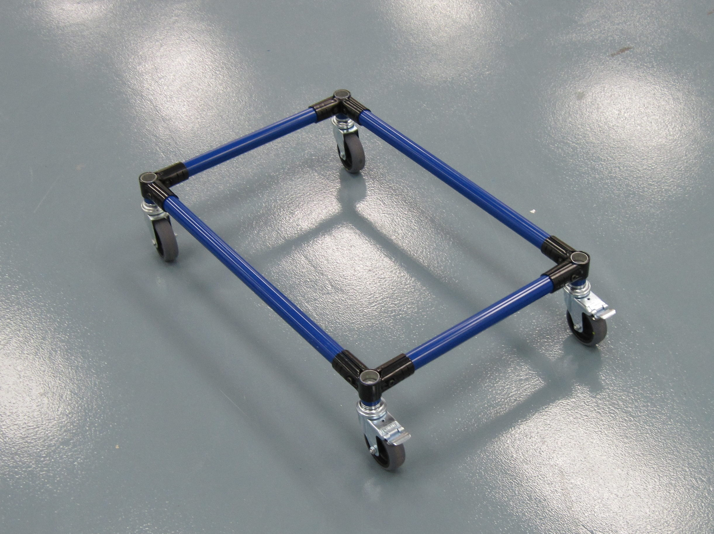
  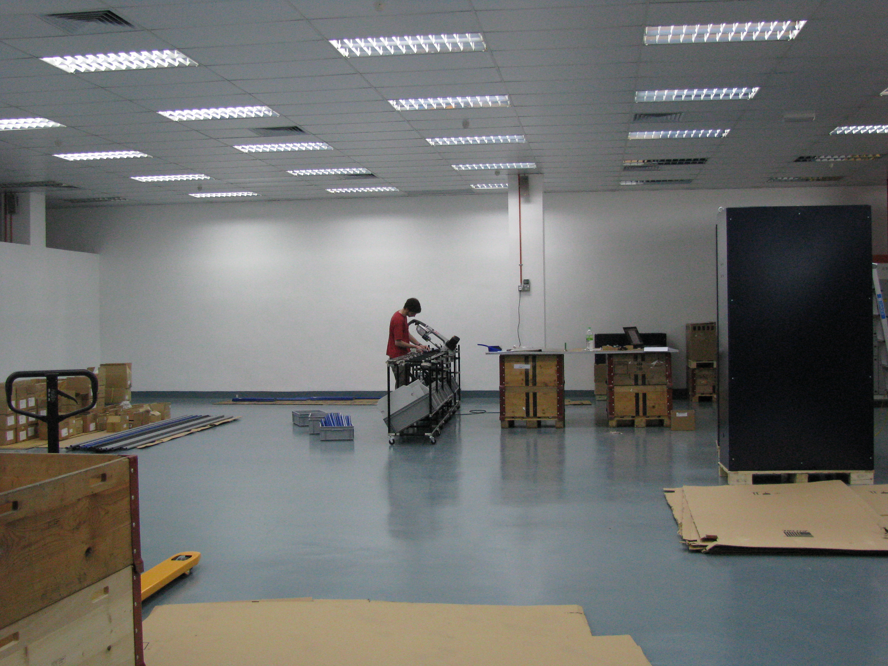


Chegávamos ao fim do mês. De repente, num aparente ápice, estávamos ali há um mês.

Em abril, a equipa iria crescer e teríamos os primeiros colaboradores connosco, ambos por intermédio do nosso diretor local. Uma secretária administrativa para o office e um ajudante para a área de produção.

Tudo pronto para no próximo dia iniciar a formação ao novo funcionário ao começar a executar a operação inicial do processo de produção , que incluía a retirada de portas e laterais dos armários rittal.

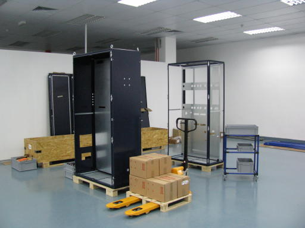

### Abril 2010 - Começa a produção

Chegava ajuda com a parte administrativa e com a barreira da linguagem local.
Na produção começava a ambientação ao nosso ambiente laboral e o contato com o material, com as ferramentas e com o manual de montagem.


  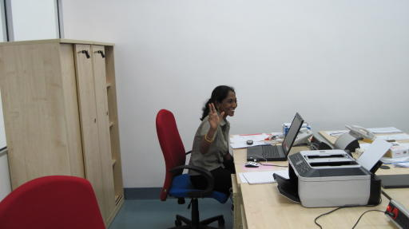
  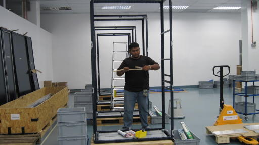


O anúncio para envio de CV´s e entrevistas de trabalho 

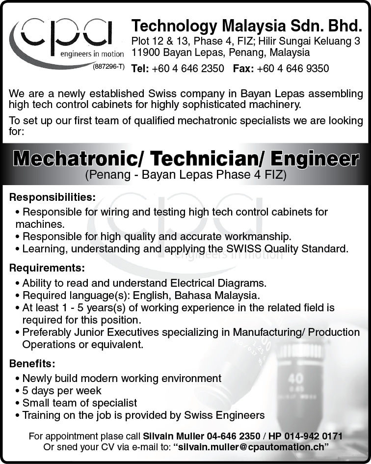

Era o arranque previsto.
Começava o ciclo zero da produção . Começava a montagem!

Pela noite continuava-se a cortar tubos e a criar a estrutura necessária para a próxima operação.

Começávamos a montar carrinhos de material e a organizar o stock.


  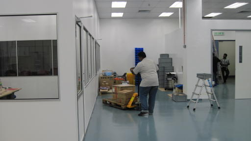
  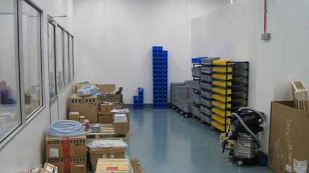


A produção continua com as áreas a começarem a ter uma forma com sentido e a permitir uma movimentação lógica e planeada.


  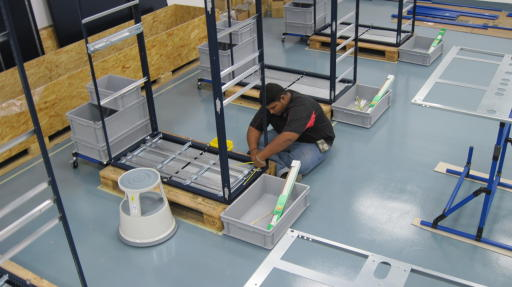
  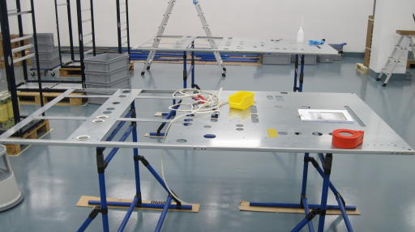


Em cada área, uma operação específica, material separado e suficiente para completar e terminar a operação, e em cada área a ferramenta, instruções de montagem e funcionalidades necessárias para levar a bom termo o termino da operação.

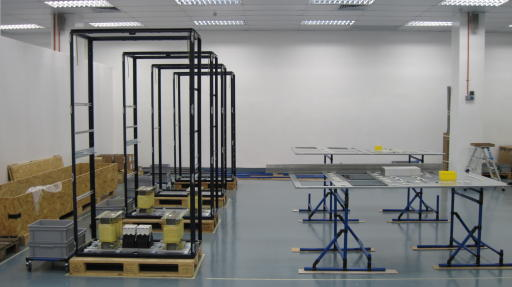

Ao fundo a passagem para o nosso cliente, com tudo apagado. Fim do dia de trabalho. Nós seguiamos com a exploração do creform e surgia a nossa primeira bancada de trabalho.


  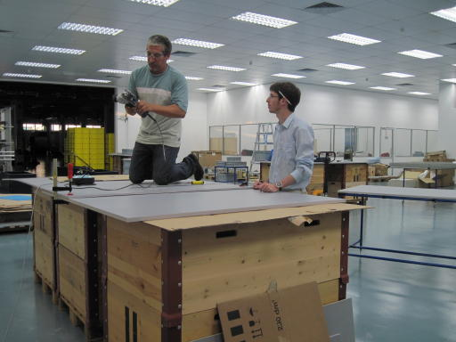
  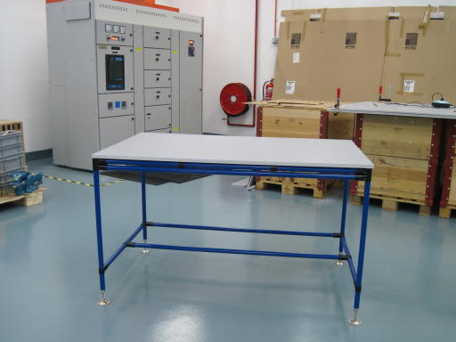


Aproximava-se o final do mês. Tínhamos filtrado CV´s e terminado as entrevistas de trabalho. Em Maio chegariam os novos funcionários.

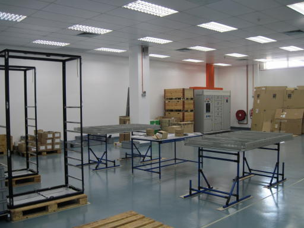

De uma forma simplista tinha organizado a zona com a operação inicial parcialmente terminada permitindo mostrar o início da operação, explicar o conceito e exemplificar o método implementado na produção.
Foi o cenário escolhido para explicar o que se pretendia aos novos colaboradores, qual o trabalho que iriam executar e mostrar as ferramentas e utensílios que teriam para efetuar essas funções.

As duas placas de comando estavam com perfis e canais de cablagem, prontas a receber componentes.
Noutra área na zona final de produção os dois quadros de força já semi-montados de forma a permitir ver o detalhe da montagem dos elementos e com alguns cabos já instalados como exemplo.


  
  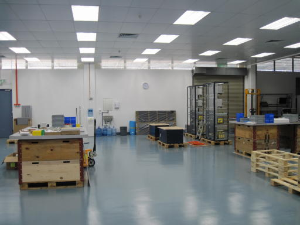


Pronto a receber formandos!

### Maio 2010 – Treino e formação

dia 3 de maio, segunda-feira chegam os novos funcionários, e começa a formação e a ambientação ao local de trabalho.


  
  
  
  
 
  


--------

Chegava a primeira visita. Um chefe de projeto chegava da Suíça para ver o nosso progresso e acompanhar os nossos planos para os próximos passos.

Foram duas semanas de formação contínua e muito planeamento.

* Muito excel, roadmaps, listas de tarefas e prioridades para gerir o flow das várias operações e etapas da produção.

* Registo da formação dada em regime laboral. Matrizes de competências. Gestão dos colaboradores.

* Stock local. Gestão do stock. Lista de faltas de material. Material danificado ou defeituoso. Relatórios de não conformidade. Zona de Quarentena.

* Gestão de avarias e acidentes durante a produção. Deteção de erros. A organização do processo de teste final da unidade produzida.

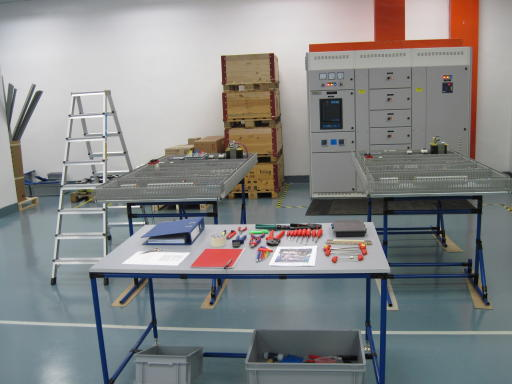

------

Chegava novo carregamento. Material para 4 máquinas, stock de cabos e outros materiais para a produção. Carga por todo o lado.


   
   
  
  
  
  


Começava o ciclo de produção efetiva. Tempo de pôr à prova todo o planeamento e a forma como tinha sido implementado o processo de produção.

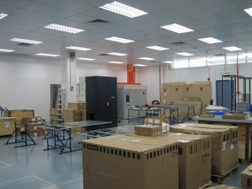

Tudo a postos para começar a produzir !

Chegavam dois colegas da Suíça para ajudar na formação do processo de cablagem e montagem do quadro elétrico.


   
   


Chegaram as t-shirts. Primeira reunião de grupo. Temos equipa.

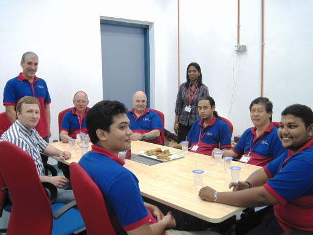


   
   


### Junho 2010 - Unidade pronta!

#### Unidade pronta!

Commissioning / Teste da primeira máquina.


  
  


#### Unidade pronta!

Dia 17/06/2010 tinamos a primeira unidade produzida, testada e pronta a entregar

  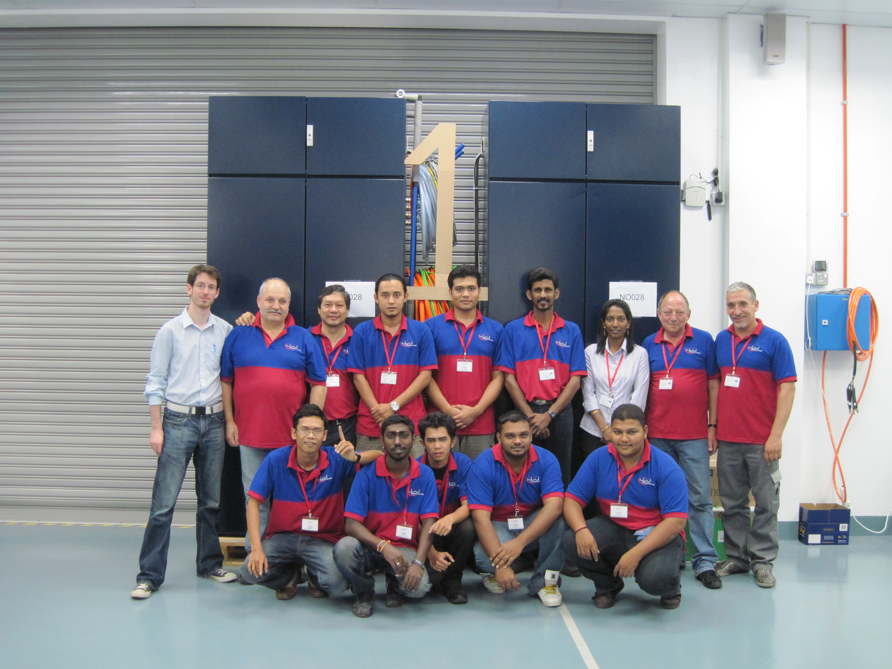

O primeiro objetivo estava alcançado e acabávamos de provar que a produção era viável.


  
  


No final de junho tínhamos uma equipa de nove elementos formada em diversas operações.

### Julho 2010 – Primeira assistência ao cliente

Logo ao início da manhã, um driver de potência literalmente explodiu dentro do quadro de força quando foi colocado em carga durante o teste final da máquina pelo cliente.

Eu tinha o privilégio de ter o apoio de uma numerosa equipa de engenharia na suíça que sempre ajudou a agilizar a resolução de problemas e a minimizar a distância física sempre que havia alterações de software ou firmware de componentes do quadro.

Um problema que se mantinha era a zona de sombra provocada pela diferença de fuso horário, 6 horas para frente agora que estávamos no horário de verão. A partir das 7 da manhã a equipa suíça estava disponível, mas já eram 13h na Malásia.

Uma avaria ao início da manhã deixava-me a enfrentar o problema sem o apoio da rede suíça.

Os danos da avaria era bem visíveis e a substituição do elemento danificado era acessível e rápida de executar. Tínhamos na linha de montagem o driver para substituir, assim que o desafio era sobretudo na elaboração do relatório da intervenção inicial junto do cliente, com informações detalhadas e fotografias da zona afetada e no processo de seguimento da identificação da causa e origem do problema e na sua resolução.

Ficha de reparação

Reports

8D

NCR

O Alex e o Martin regressam à suíça. Termina a formação suíça.

### Agosto 2010 – Missão completa

Em agosto a produção continuava e tínhamos o stock cheio de unidades prontas a entregar.

A produção fluía dentro dos tempos, e o segundo objetivo era atingido em Julho como previsto.

Estava completa a missão. A estrutura estava montada e a funcionar e o mesmo se aplicava à produção.

O Silvan tinha terminada a sua missão. Já tinha saído para gozar férias e agora retornaria em setembro para eu também sair e regressar à Europa, ter um merecido descanso em Portugal e passar pela empresa na suíça para apresentar relatório final da missão e preparar o futuro.

Continua-se a criar mais e novas estruturas em creform

A produção continuava

