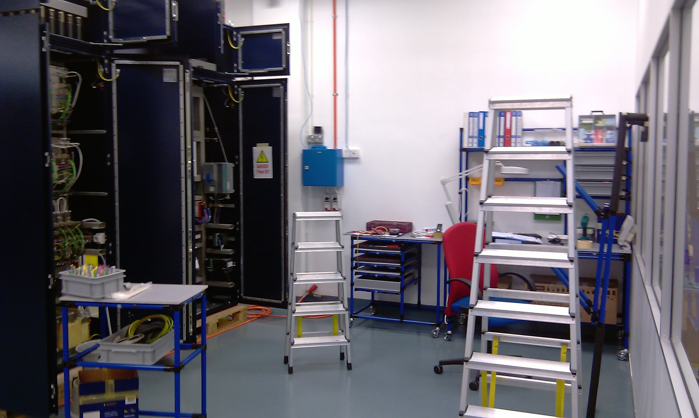
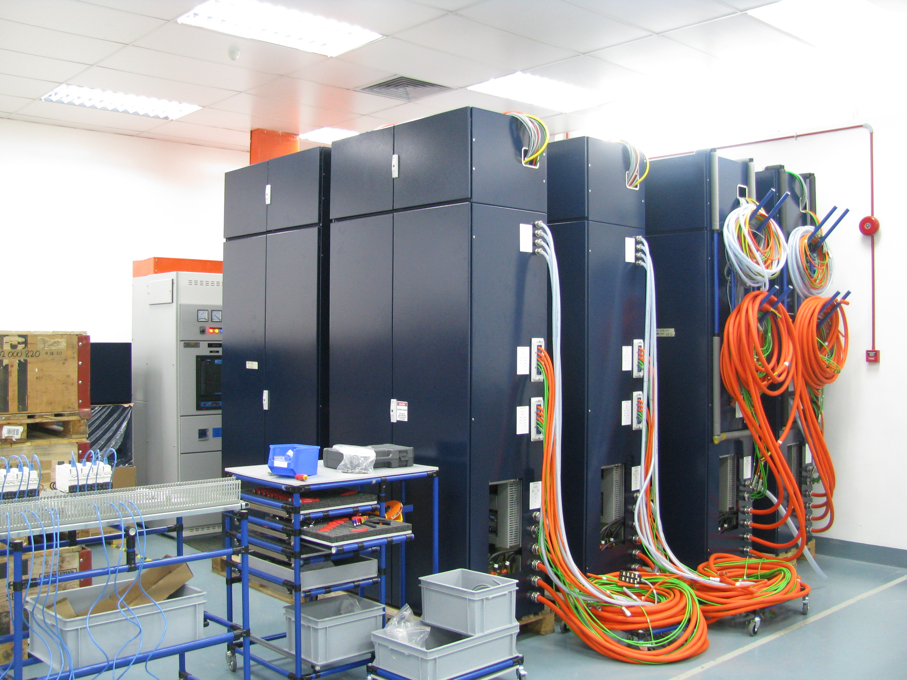
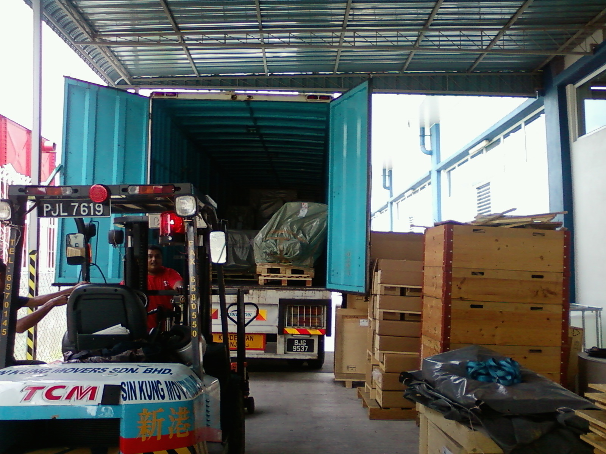
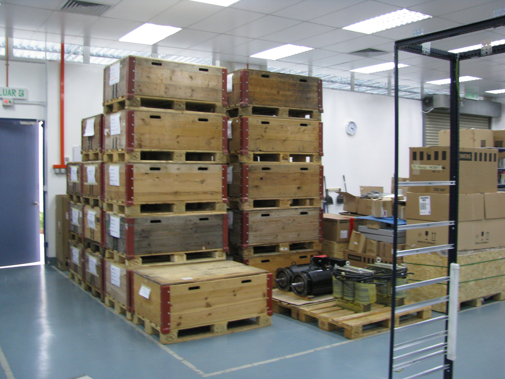

+++
date = '2026-03-08T20:13:02Z'
draft = false
title = "Missão Malásia - parte 2"
showHero = true
  heroStyle = "background" # valid options: basic, big, background, thumbAndBackground
  layoutBackgroundBlur = true # only used when heroStyle equals background
  layoutBackgroundHeaderSpace = true # only used when heroStyle equals background
showTableOfContents = true
showZenMode = true
series = [ "Missão Malásia" ]
series_order = 2
+++

# Missão Malásia - segunda parte

## Aventura profissional na Malásia em fotografias comentadas

## Missão a Solo

Eu sempre acreditei e com tudo a correr pelo melhor desde maio que já era ponto assente que a aventura continuaria com mais uma missão, e muito do trabalho a partir daí foi já em preparação deste segundo passo.
Em Setembro terminadas as férias voltava à <a href="https://cpautomation.ch/en/" target="_blank" rel="noopener">CPA</a> na suíça para receber instruções e iniciar a segunda missão.

A produção tinha sido validada pelo cliente final e tínhamos uma encomenda de 32 unidades de 500SDB6 -MaxEdge a produzir até ao fim do primeiro semestre de 2011.

Em paralelo teria de preparar a produção para a montagem de outro quadro elétrico, desta vez para a máquina 500SDB5 . O B5 era um quadro elétrico que eu conhecia bem. Tinha começado a trabalhar na empresa em 2007 e a minha primeira tarefa foi precisamente cablar a placa de comando para o quadro B5.

O grande desafio desta segunda missão era o facto de ir assumir a gestão das operações.
O regresso à Malásia seria sozinho. Iria acumular a gestão das operações com a gestão da produção.

Os objetivos da missão eram:

* Como primeiro objetivo teria de criar a capacidade de ter produção em simultâneo de dois quadros elétricos com possibilidade de acelerar a produção de cada um deles de forma independente.

* Com a produção validada entravamos na cadeia de fornecedores do nosso cliente final, a <a href="https://www.appliedmaterials.com/eu/en.html" target="_blank" rel="noopener">AMAT - Applied Materials</a>, que tinha critérios e padrões de qualidade muito elevados. Estava prevista uma primeira auditoria em breve e receber luz verde de plena produção era o segundo objetivo.

Do lado da produção teria de cumprir o planeamento para a produção de todos os 32 pares quadros MaxEdge e continuar a garantir o apoio técnico ao cliente, a <a href="https://stoppani-metal-systems.ch/en/home-english/" target="_blank" rel="noopener">Stoppani</a>.

Do lado das operações tinha de criar cenários alternativos, quer para duplicar a produção quer para reduzir para metade. Em ambos os produtos. Teria de ser versátil.

## O sistema creform

O sistema <a href="https://www.creform.com/" target="_blank" rel="noopener">creform</a>
revelou-se essencial no desenvolvimento de mobiliário, com a enorme versatilidade e sobretudo a reutilização de componentes que nos permitia continuar a desenvolver novos projetos e sempre a melhorar o mobiliário de produção.


   
   


---
> [!TIP]- Vou criar outro post só com fotos de estruturas creform

{icon="star"}

## Quadro elétrico 500SDB5

Esta aventura foi despoletada pela 500SDB6. Chamada de MaxEdge a nova máquina da AMAT prometia o corte de lingotes de sílicio nas "wafers" com velocidade e qualidade muitissimo superior à 500SDB5. A promessa parecia não ter sido completamente cumprida e a procura pela máquina 500SDB5 continuava.

Nesta segunda missão teria de preparar a nossa produção para começar a montagem do quadro elétrico 500SDB5 ou simplesmente B5.

> [!abstract]link 
<a class="text-sm" href="https://markets.financialcontent.com/stocks/news/read/8272212/applied_materials_delivers_major_advances_to_lower_solar_cell_cost_with_new_hct_maxedge_wire_saw#google_vignette" target="_blank" rel="noopener">AMAT anuncia o lançamento da MaxEdge a 16 março 2009</a>

### Outubro

A produção de quadros para a MaxEdge continuava e estávamos com um stock que nos permitiria responder a um eventual aumento de produção e que me permitia focar na nova linha de produção para o quadro da B5.

O primeiro desafio foi atravessar outra vez o caminho da burocracia da importação de componentes para um novo produto. Estávamos dentro da FIZ- Free Industrial Zone, que de uma forma simples nos colocava dentro da zona anexa à alfandega do aeroporto, e que nos permitia vender e “exportar” para outro cliente também dentro da FIZ sem sair da zona alfandegaria. O processo de autorização para a importação de componentes era complexo com listas de material classificadas por tipos e códigos de importação. Tinha assistido o Silvan em março de 2010 com o processo de importação para a B6. Agora era eu a organizar todo o processo.

Com isto ultrapassado tive de me concentrar na gestão e sobretudo na organização do stock. Até ali todos os componentes eram para o mesmo único produto final. Agora haveria componentes para dois quadros elétricos diferentes com duas linhas de produção diferentes.

Era necessário reforçar a equipa com novos colaboradores. Foi todo um novo processo, através de um novo anúncio, selecão de candidatos e marcação das entrevistas de trabalho.

Veio novamente uma equipa da suíça com dois cabladores para ajudar na formação. Era necessário reforçar a equipa com novos colaboradores.

 
 
## 9/11 - Armário 500SDB5

Chegava o carregamento com material para produzir dois quadros elétricos B5.

 O desafio seguinte seria  criar uma nova linha do novo processo, para produção em paralelo de ambos os modelos de quadros elétricos.


  
  


30/11/2010

### Obras expansão

Conseguíamos mais alguns metros de produção e uma nova entrada com área para cacifos e vestiário.

Em fevereiro terminava a expansão com a remoção da parede interna.

## 2011
### Fevereiro 2011


  
  




13/02 -A produção de MaxEge continua, e por trás a montagem do primeiro quadro B5.



Aqui cablagem de três placas de comando.
As duas da esquerda são placas da MaxEdge e, a da direita é do segundo quadroB5.
Implementava-se a produção em paralelo.

Tinha passado um ano na Malásia.

A CPA Technology completava o primeiro aniversário e a equipa tinha crescido.


  
  


05/04/2011
segunda expansão, muda-se o office para a sala de reuniões que desaparece. Temos a área de produção maximizada.


  
  


05/04 armário montado na máquina



12/04


  
  


21/04- Produção em simultâneo de quadros diferentes.
De um lado Maxedge, do outro lado B5.

21/04


  
  


27/04/2011
### Formação SSQA AMAT Singapore

#### Standardized Supplier Quality Assessment 

No principio do ano, tinha recebido a primeira visita do cliente.
Foram definidas áreas de intervenção e estabeleceu-se um roadmap a 6 e 12 meses.
Tínhamos autorização para fornecer o quadro elétrico, mas teria de haver um responsável pela qualidade no local com formação dada pelo cliente.
Em Abril fui a Singapura receber uma formação (SSQA - Standardized Supplier Quality Assessment) dada pela AMAT.
Ficava também com a gestão da qualidade.

### 06/05 company dinner


  
  


23/06/2011
## 32ª Máquina – Produção de MaxEdge completa

A final de junho terminava a produção dos quadros elétricos para a MaxEdge, com a 32ª unidade.





25/06

Fim da formação pelos técnicos suíços.
Formação B5 concluída.
Entrega da 32ª e última unidade MaxEdge.

Objetivos superados e fim de missão para mim.



Iria em breve saber o resultado do meu SSQA que tinha consumido grande parte do meu tempo nos últimos dois meses.
A produção de MaxEdges estava suspensa e o cliente convertia a sua área total para a produção de máquinas 500SDB5.
Tempo de preparar a continuação.



